# Installation Guide
This is a guide on how to install the Syllabot Slack app onto your Slack's workspace. Installing the Syllabot Slack app will allow users in your Slack workspace to use the '/ask' command to ask questions about your course and receive answers form an AI.

## Create Syllabot
1. Visit the [Slack Api site](https://api.slack.com/apps) and click the "Create New App" button.
 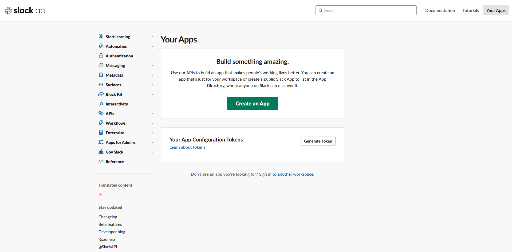 
2. A pop-up window will appear titled "Create an app". On this pop-up select "From an app manifest"
 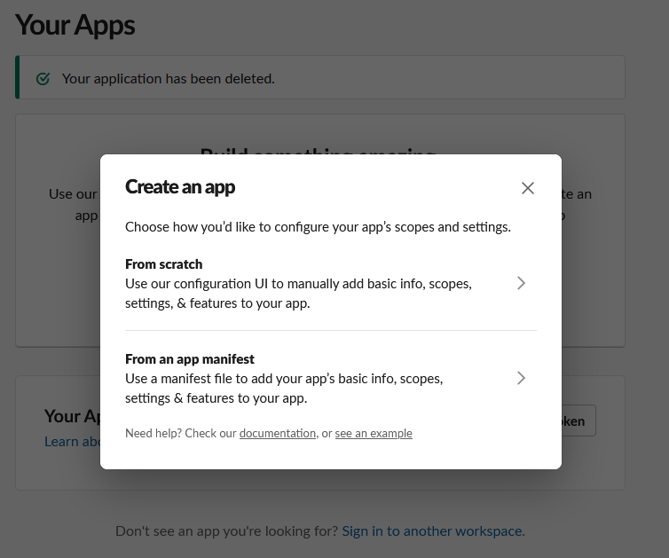 
3. You will be prompted to choose a workspace. From the dropdown list select the workspace where you want to add Syllabot. Click "Next" once you have chosen the workspace.
 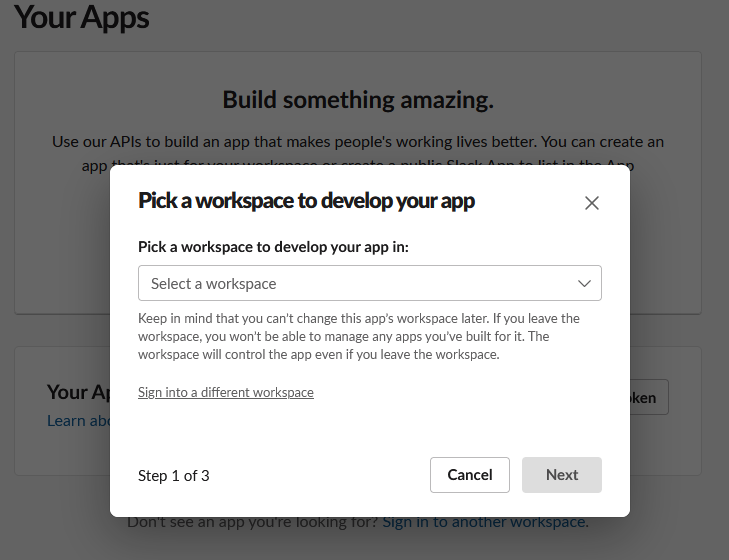 
4. Inside the text box, paste the content of the [manifest.yml](https://github.ncsu.edu/engr-csc-sdc/2023FallTeam06-Syllabot/blob/slack/Slack/manifest.yml). Make sure in the tab at the top YAML is selected instead of JSON. Click "Next" once you have pasted the content.
  
5. Review the features of the app and make sure you approve. The following information should be displayed in each tab:
   
<strong>OAuth</strong>
 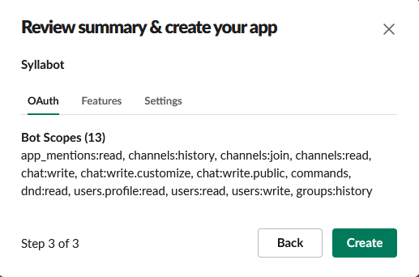 

<strong>Features</strong>
 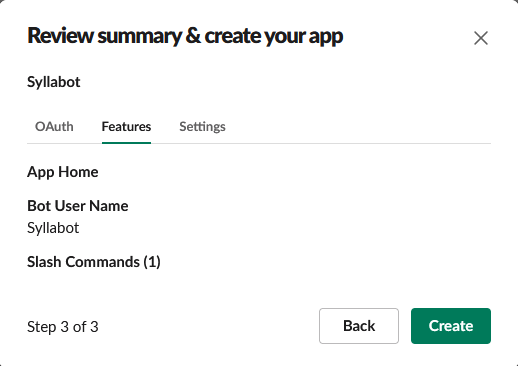 

<strong>Settings</strong>
 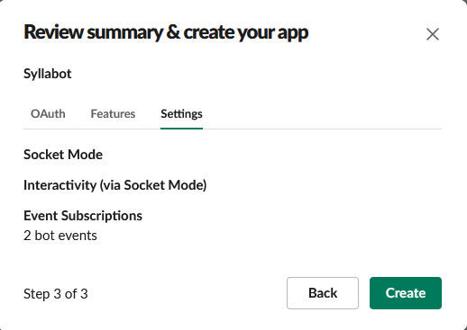 

After reviewing the information click the "Create" button

## Setting up Syllabot
<strong>IMPORTANT: The tokens in this section should be kept private. Giving the token to other people allows them to take control of the app within your workspace.</strong>

1. Visit the [Slack Api site](https://api.slack.com/) and select "Syllabot" from the "Your apps" dropdown in the top right of the page. If you are continuing from the previous section you should already be at this page.
 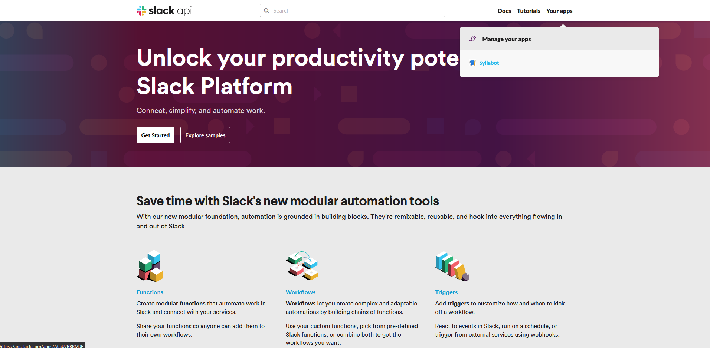 
2. Click the "Basic Information" tab from the left sidebar
 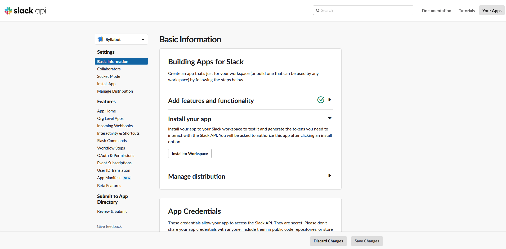 
3. Click "Show" under the "Signing Secret" and place the value in the "Signing Secret" section of your course's Syllabot page.
 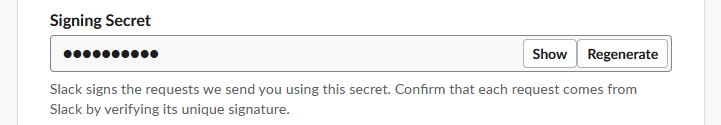 
4. Scroll down to "App-Level Tokens" and click "Generate Token and Scopes"
 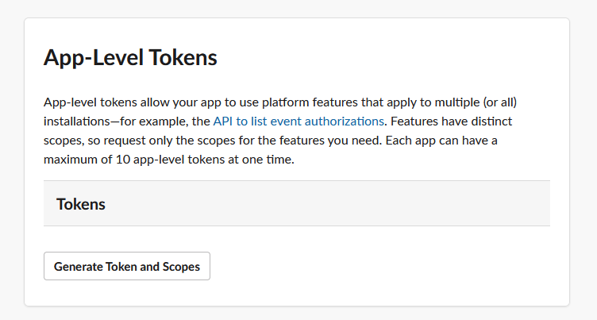 
5. In the "Token Name" field add "SOCKET_TOKEN", click  the "Add Scope" button and click "connections:write". Click "Generate"
 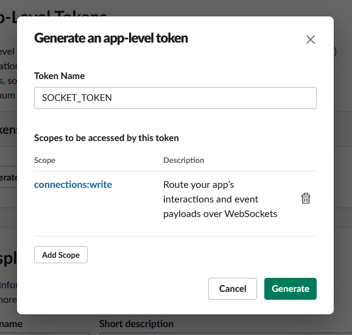 
6.   Copy the newly created SOCKET_TOKEN token and place the value in the "Socket Token" section of your course's Syllabot page.
7.    Click the "OAuth & Permissions tab from the left sidebar
 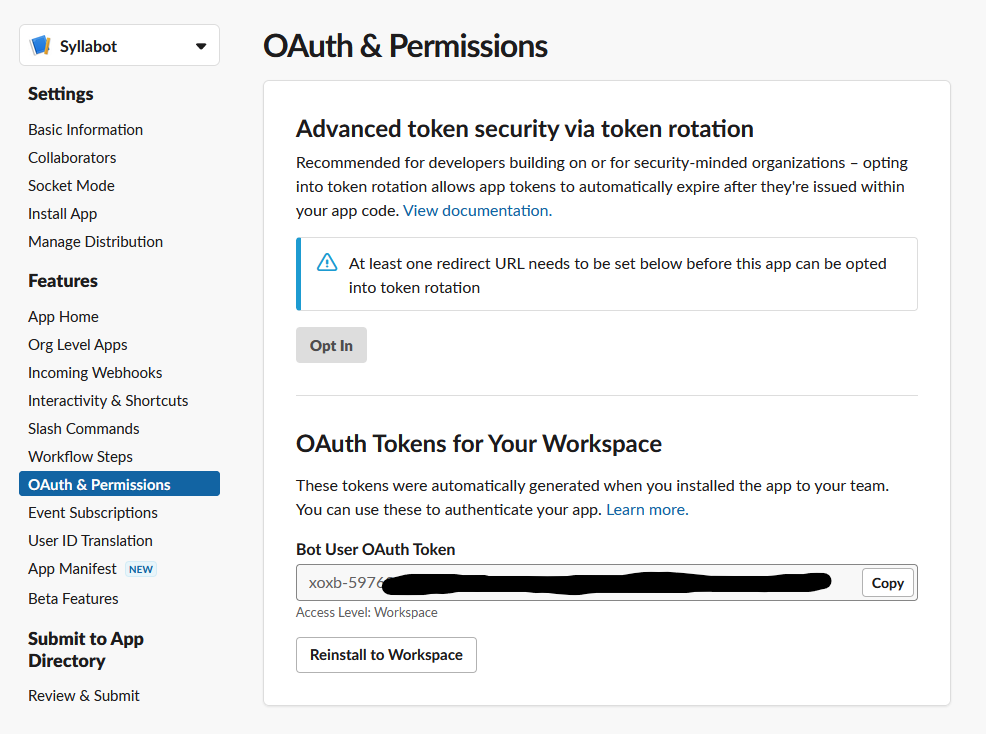 
8.    Copy the "Bot User OAuth Token" and place the value in the "Slack Token" section of your course's Syllabot page.
9.    Click "Confirm" on the course's Syllabot page.
10. Click the "Basic Information" tab from the left sidebar
  
11. Click "Install to Workspace" under the "Install your app" header.
 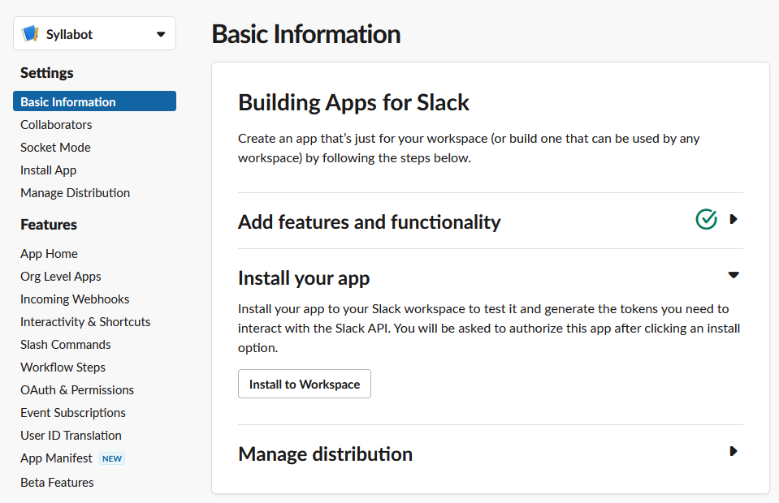 
12. Click "Allow"
 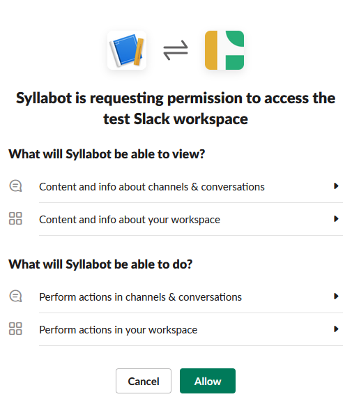 
13. Navigate to the Slack Workspace where you added the Slack app
14. In every channel you want students to be able to ask questions to Syllabot type the command "/invite @Syllabot"
 
Congratulations! Syllabot is now completely added to your classes' Slack workspace!